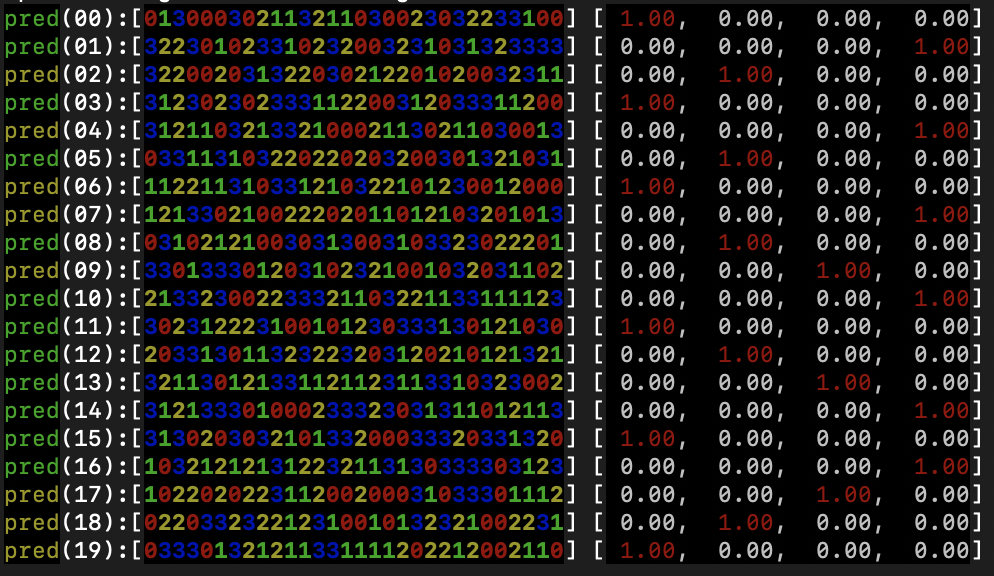
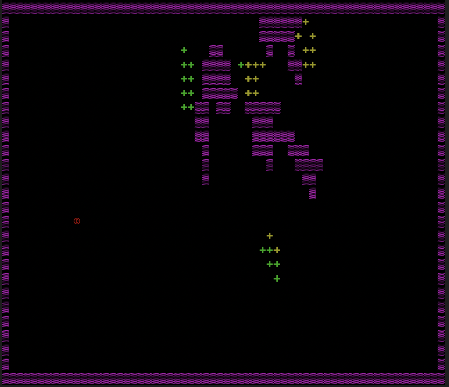
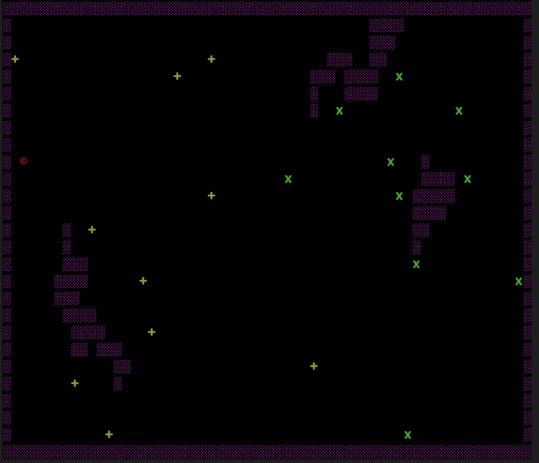
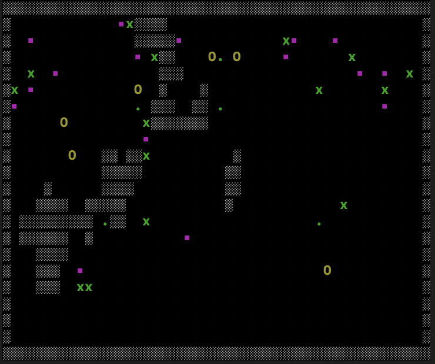
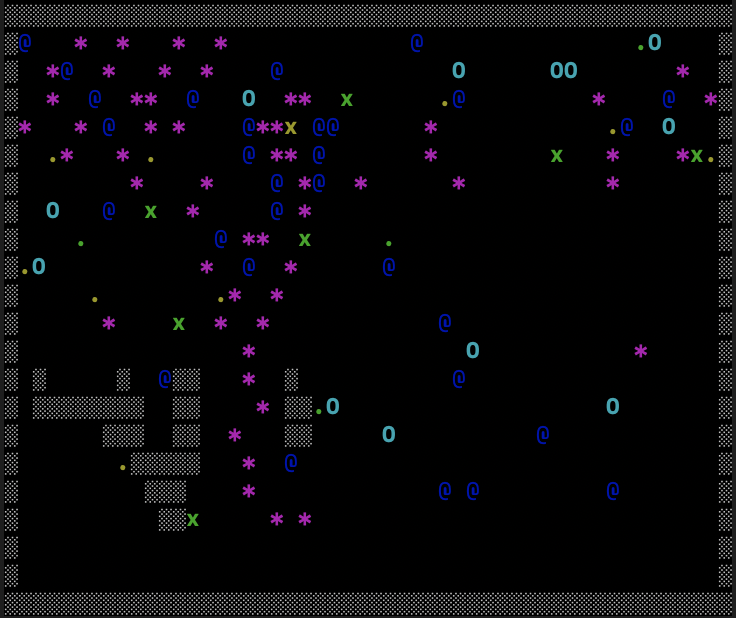
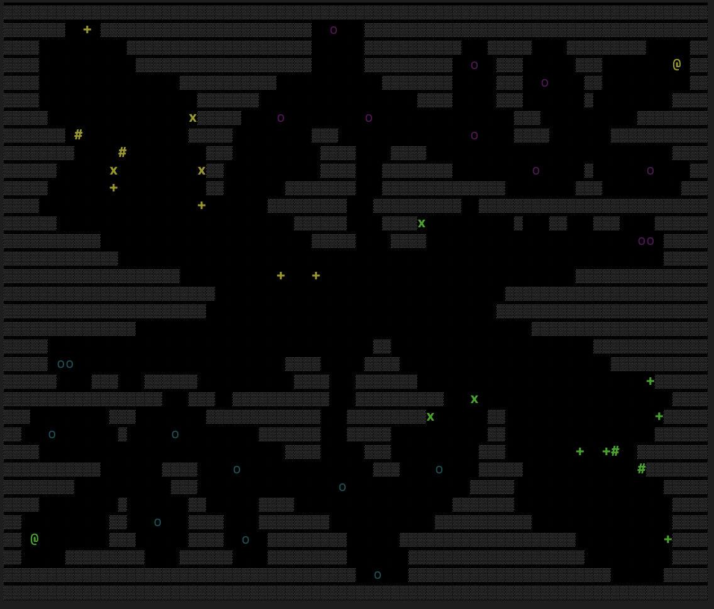

# MARL
Multi-Agent Reinforcement Learning Experiments

# Requirements
pytorch and numpy

# Introduction
Multi-Agent Reinforcement Learning (MARL) is an area of research that has interested me for quite some time - especially after seeing what OpenAI five's Dota 2 (https://openai.com/projects/five/) and DeepMind's AlphaStar Starcraft II (https://deepmind.com/blog/article/alphastar-mastering-real-time-strategy-game-starcraft-ii) projects were able to achieve. I decided to run some simple MARL experiments of my own in order to familiarize myself with the implementation of these mechanisms and to observe how agents cooperate with one another to solve problems. This work is loosely aligned with F-Secure's Project Blackfin (https://www.f-secure.com/en/about-us/research/project-blackfin) - a research project aimed at using collective intelligence techniques to solve cyber security problems. One of Project Blackfin's aims is to discover and utilize emergent behaviours that arise from the interaction of many simple agents in a system. Although the experiments detailed here aren't directly applicable to the cyber securty field, I hoped to find interesting emergent behaviours in the experimental environments that might spark some creativity when considering other application areas.

# Implementation
Each experiment consists of a game (xxx_game.py) and a training algorithm (xxx_game_train.py). All experiments involve the interaction of separately trained agents in a two-dimensional grid. The game can be observed by setting **print_visuals=True** in the corresponding xxx_game_train.py file. I coded this on a Mac, and haven't tried it on any other operating system. As such, I'd expect the visuals output to work on Linux, but perhaps not on Windows. Setting this value to false will train the scenario silently (printing some output after each episode completes), which is much faster. Expect to train for a couple of weeks to see any results. To run a scenario, simply execute:
> python xxx_game_train.py

Agents in all games can only see a certain number of tiles in all directions. This viewing distance is denoted by the **visible** variable in misc.py. If, for instance, **visible** is set to 4, each agent will be able to see 4 cells to the left, right, up, and down - in other words, a 9x9 grid. This visible area represents the agent's state, which is used when training each model. The game area is represented by a two-dimensional array where each item is coded via a different integer (0 for empty space, 1 for wall, etc). The numerical representations of different items in each game are specific to that game.

You can change the size of the game space (**game_space_width** and **game_space_height**) and, generally speaking, you can also change the number of agents (**num_agents**) and a few other parameters (all in xxx_game_train.py). By and large, the play areas are randomly generated, and the amount of walls can be adjusted by changing the **walls** variable.

During training, the models, and some statistics are saved after each episode in a directory named **modeltype_gamename_game_save**. Relaunching a script will attempt to load the saved models. If you increase the number of agents after models have been saved, new models will randomly obtain parameters from one of the previously saved models. If a model starts to NaN (which occasionally happens), determine which one it is, delete the parameters, and copy another model's parameters into its place.

The **print_preds** variable allows one to visualize model predictions. I used it while developing these experiments, but haven't enabled it lately, so it might be broken. Anyways, if it does work, you'll see an output like this:

Machine learning models are implemented in separate files. Currently there are six different models in this repository. A description of each model can be found in misc.py. While setting these experiments up, I spent a great deal of time trying to find a model that would actually learn to do something. I started with DQN, which didn't work, attempted to get it to learn something by adding RNN and attention mechanisms to it, which still didn't work, and then tried many other things. In the end, I found a model that was capable of learning. This model is based on policy gradients and RNN, and is implemented in PG.py. All models are wrapped via misc.py, and I left the non-working ones in this repo just for reference. This is why the implementation looks rather clunky, and I really didn't feel like going back to pretty it up. You'll also notice that most of the xxx_game_train.py files contain duplicate code. That's something that could also be cleaned up, perhaps some other time.

An explanation of each experiment follows.

## PVP
This experiment is implemented in pvp_game.py and pvp_game_train.py. Agents are assigned to one of two teams. They all start with a certain number of hitpoints (10) and can move left, right, up, or down. If an agent is adjacent to a member of the opposite team and "pushes" in their direction, that opponent loses one hitpoint, and the agent that performed the action receives a reward. The game is designed to study an adversarial scenario where the agents learn to work as a team to destroy the other team's agents before being destroyed themselves. It is based on some nice demos I found on the MAgent github repo (https://github.com/LantaoYu/MAgent).

## Tag
This experiment is implemented in tag_game.py and tag_game_train.py. Agents are assigned to one of two teams, in equal numbers. Agents can "tag" a member of the opposing team, converting that agent to their team. This happens when two agents from team 1 are adjacent to an agent from team 2 that is not adjacent to another members of team 2. Converting a member of the opposing team grants a reward to all agents involved in the conversion. I figured that this reward structure alone might force the agents of each team to swarm together defensively and never tag a member of the opposing team (who would be doing the same), so I added randomly spawning items that, if picked up (by moving over them) would also grant a reward. Thus, it might entice agents to separate from the swarm, if they got greedy.

## Rocks
This experiment is implemented in rocks_game.py and rocks_game_train.py. In this scenario, all agents are assigned to the same team. At the start of each episode, a series of rock piles and holes are spawned in the game area. If an agent moves against a rock pile, they pick up a rock. If they move against a hole while holding a rock, they drop it in, and gain a reward. I gave the agents one extra ability - drop rock - if an agent is holding a rock, the drop rock action will place it on the floor to their left, if the tile is empty. This action is a red herring - agents should eventually learn to simply pick a rock from a rock pile and take it to a hole without the need to drop it. Of course, while learning what to do, the agents will try random actions and fill the play area with rocks, which is fun to watch.

## Coop rocks
This experiment is implemented in coop_rocks_game.py and coop_rocks_game_train.py. This scenario is similar to the rocks scenario. All agents are on the same team. However, there are two types of agent - miners and collectors. If a miner pushes against a rock pile, they will pick up a rock. They can then drop it using the "drop" action onto an empty tile (in the direction they last moved) to receive a reward. If the tile is not empty, they will not drop the rock. Collectors can only pick up individual rocks that miners have dropped (they cannot pick up rocks from rock piles). If a collector is carrying a rock, they can drop it into a hole by pushing against the hole to receive a reward. Miners cannot drop rocks into holes. This scenario is designed to force cooperation between miners and collectors.

## Alterac Valley
Alterac Valley is an instanced, large-scale (40 versus 40) player versus player battleground in the World of Warcraft that has existed since Classic. During Classic, battles in Alterac Valley could sometimes last days. The aim of this battleground is to destroy the opposing team's commander. In order to do this, players must first take out lieutenants and complete some other objectives. The original battleground contained a large variety of side-goals and quests, that led to extremely rich back-and-forth exchanges between the two competing teams. The battleground was later reworked into a 15-minute scenario in order to fit into Blizzard's goals of providing quickly completable content. After these changes were made, a majority of Alterac Valley games consisted of each team ignoring the other and rushing to kill the commander. In this experiment, I wanted to determine whether AI teams would come to the same conclusion. Of course, my simulation is a vastly simplified version of Alterac Valley.

This scenario different from the others in that each team is of fixed size, and each team member always spawns at a precise location, and the map is not randomly generated. Each team consists of three different types of agent:
- melee units that can attack adjacent units by "pushing" into them
- ranged units that gain a "fire" ability which randomly targets an enemy within range
- healer units that gain a "heal" ability which will heal a damaged friendly unit in range. Healers have no attack ability.

Melee units do more damage to ranged and healers and take less damage from attacks.

Each team also has a number of stationary lieutenants and a commander. Attacking a lieutenant will cause the agent to take damage. The agents should learn to only do this if a healer is nearby. Attacking the commander will cause the attacking unit to take damage equal to the number of lieutenants still alive. Hence, the attacking team must kill all lieutenants before attacking the commander to avoid their units being one-shot.

Agents can, of course, attack members of the opposite team. If a team member runs out of hitpoints, they'll respawn at their original starting location, and a "reinforcements" counter will be decreased (the counter is also decreased if a unit kills themselves by attacking a commander or lieutenant). If a team's reinforcements counter reaches zero, the other team wins. Thus, there are two ways to win - kill the commander or kill the other team members until their reinforcements run out. This experiment should allow us to observe which path the AI considers more optimal.

# Observations
This section will contain observations obtained from these experiments, if anything interesting arises.
